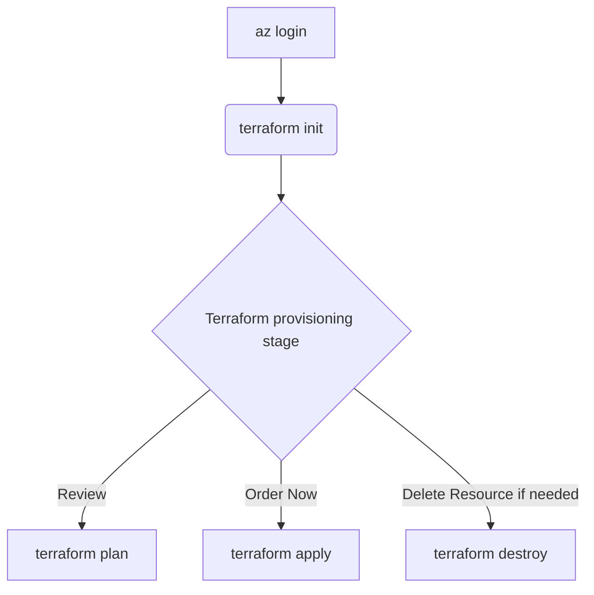

# Level 4 - Optimized: Implement Advanced Automation

Costa Rica

[](https://github.com/)
[brown9804](https://github.com/brown9804)

Last updated: 2025-02-27

----------

## Content 

- [Automation Tools](#automation-tools)
    - [Azure Automation: Create an Automation Account](#azure-automation-create-an-automation-account)
    - [Azure Automation: Develop Runbooks](#azure-automation-develop-runbooks)
    - [Azure Automation: Schedule Runbooks and Set Up Webhooks](#azure-automation-schedule-runbooks-and-set-up-webhooks)
    - [Logic Apps: Create a Logic App](#logic-apps-create-a-logic-app)
    - [Logic Apps: Use Connectors](#logic-apps-use-connectors)
    - [Logic Apps: Create Workflow](#logic-apps-create-workflow)
    - [Function App: Create a Function App](#function-app-create-a-function-app)
    - [Function App: Develop Functions](#function-app-develop-functions)
    - [Function App: Configure Triggers and Bindings](#function-app-configure-triggers-and-bindings)
- [Orchestration](#orchestration)
- [Infrastructure as Code IaC](#infrastructure-as-code-iac)
    - [Azure Resource Manager ARM Templates](#azure-resource-manager-arm-templates)
    - [Terraform](#terraform)


## Automation Tools

1. **Create an Automation Account**: In the Azure portal, search for `Automation Accounts` and create a new account.
2. **Runbooks**: Develop runbooks to automate routine tasks. Use PowerShell or Python scripts to define the automation logic.
3. **Schedules and Webhooks**: Schedule runbooks to run at specific times or trigger them via webhooks for event-driven automation.

###  Azure Automation: Create an Automation Account

1. **Sign in to Azure Portal**: Go to the [Azure portal](https://portal.azure.com) and sign in with your Azure account credentials.
2. **Search for Automation Accounts**: In the search bar at the top of the Azure portal, type `Automation Accounts` and select it from the search results.

     

3. **Create a New Automation Account**:
   - Click on the `+ Create` button to start the creation process.
   - Fill in the required fields:
     - **Subscription**: Select the Azure subscription you want to use.
     - **Resource Group**: Choose an existing resource group or create a new one.
     - **Name**: Provide a unique name for your Automation Account.
     - **Region**: Select the region where you want to create the Automation Account.
   - Click `Review + Create` and then `Create` to finalize the creation.

       

### Azure Automation: Develop Runbooks

1. **Navigate to Your Automation Account**: After the Automation Account is created, navigate to it by selecting it from the list of Automation Accounts.

     

2. **Create a Runbook**:
   - In the Automation Account menu, select `Runbooks` under the `Process Automation` section.
   - Click on `+ Create a runbook` to start the creation process.

       

   - Fill in the required fields:
     - **Name**: Provide a name for your runbook.
     - **Runbook Type**: Select the type of runbook (e.g., PowerShell, Python).
     - **Description**: Optionally, add a description for your runbook.

        

   - Click `Create` to create the runbook. For example:

        

3. **Edit the Runbook**:
   - After creating the runbook, you will be taken to the runbook editor.
   - Write your automation logic using PowerShell or Python scripts.
      > For example [Start or Validate VM Status and Update Python Core Libraries](./src/update_vm_and_python_libraries.py)
      > or a simple PowerShell script to start a VM:
        ```powershell
        param(
            [string]$ResourceGroupName,
            [string]$VMName
        )
   
        Start-AzVM -ResourceGroupName $ResourceGroupName -Name $VMName
        ```
   - Click `Save` to save your script.
4. **Publish the Runbook**: After saving the runbook, click `Publish` to make it available for execution.

     


### Azure Automation: Schedule Runbooks and Set Up Webhooks

1. **Schedule a Runbook**:
     - In the runbook's overview page, select `Schedules` under the `Resources` section.
     - Click on `+ Add a schedule` to create a new schedule.
     
          

          

     - Fill in the required fields:
          - **Name**: Provide a name for the schedule.
          - **Description**: Optionally, add a description for the schedule.
          - **Start Time**: Set the start time for the schedule.
          - **Recurrence**: Choose the recurrence pattern (e.g., one-time, daily, weekly).
     - Click `Create` to create the schedule.

          

     - Link the schedule to the runbook by selecting the schedule and clicking `OK`.

          

2. **Set Up a Webhook**:
     - In the runbook's overview page, select `Webhooks` under the `Resources` section.
     - Click on `+ Add webhook` to create a new webhook.

          

          

   - Fill in the required fields:
     - **Name**: Provide a name for the webhook.
     - **Enabled**: Choose whether the webhook is enabled or disabled.
     - **Expiry Date**: Set an expiry date for the webhook.

          

     - Click `Create` to create the webhook.

          

   - Copy the webhook URL and use it to trigger the runbook from external systems or applications.
     

### Logic Apps: Create a Logic App

> [!NOTE]
> Please create a logic app if you do not already have one or need a specific resource for this purpose. Click here to learn more about [Logic App hosting options](https://learn.microsoft.com/en-us/azure/logic-apps/logic-apps-overview#create-and-deploy-to-different-environments)

1. **Sign in to Azure Portal**: Go to the [Azure portal](https://portal.azure.com/) and sign in with your Azure account credentials.
2. **Search for Logic Apps**: In the search bar at the top of the Azure portal, type `Logic Apps` and select it from the search results.

     

3. **Create a New Logic App**:
   - Click on the `+ Create` button to start the creation process.
   - Fill in the required fields:
     - **Subscription**: Select the Azure subscription you want to use.
     - **Resource Group**: Choose an existing resource group or create a new one.
     - **Logic App Name**: Provide a unique name for your Logic App.
     - **Region**: Select the region where you want to create the Logic App.
     - **Plan Type**: Choose between `Consumption` (pay-per-use) or `Standard` (fixed pricing).

          

   - Click `Review + Create` and then `Create` to finalize the creation.

     

### Logic Apps: Use Connectors

| Action                         | Description                                                                 |
|------------------------------|-----------------------------------------------------------------------------|
| **Explore Built-in Connectors** | - Logic Apps provides a wide range of built-in connectors to integrate with various services, including Azure services, third-party applications, and on-premises systems.<br>- In the Logic App Designer, click on `+` and browse the list of connectors. |
| **Add Connectors to Your Workflow** | - Select the connector you want to use (e.g., `Office 365 Outlook`, `Azure Blob Storage`).<br>- Configure the connector by providing the necessary authentication details and parameters. |
| **Custom Connectors**        | - If a built-in connector is not available for your specific service, you can create a custom connector.<br>- In the Azure portal, search for `Custom connectors` and follow the steps to create and configure a custom connector. |

### Logic Apps: Create Workflow

1. **Go to Your Logic App**: After the Logic App is created, navigate to it by selecting it from the list of Logic Apps.
2. **Create a workflow**: Under Workflows, click on `+ Add`:

   

3. The Logic App Designer provides a visual interface to create and manage workflows, for that click on workflow created:

     

4. **Add a Trigger**:
     - Every Logic App workflow starts with a trigger. Click on `New step` and search for a trigger that suits your needs (e.g., `When a HTTP request is received`, `Recurrence` for scheduled workflows).

          

     - Configure the trigger by providing the necessary details (e.g., URL, schedule).

5. **Add Actions**:
     - After adding a trigger, click on `+` to add actions to your workflow.
     
          
     
     - Search for and select the actions you need (e.g., `Send an email`, `Create a file in OneDrive`).

          

     - Configure each action by providing the required parameters.

6. **Use Conditions and Loops**:
     - You can add conditions and loops to control the flow of your workflow.
     - Click on `+` and search for `Condition` to add conditional logic.
     - Search for `Apply to each` or `Until` to add loops.

     

7. **Save and Test the Workflow**:
   - After designing your workflow, click `Save` to save your changes.
   - Use the `Run Trigger` button to manually trigger the workflow and test its functionality.
   - Check the `Runs history` to see the execution details and troubleshoot any issues.

### Function App: Create a Function App

1. **Sign in to Azure Portal**: Go to the [Azure portal](https://portal.azure.com/) and sign in with your Azure account credentials.
2. **Search for Function Apps**: In the search bar at the top of the Azure portal, type `Function Apps` and select it from the search results. Click here to learn more about [Functions hosting options](https://learn.microsoft.com/en-us/azure/azure-functions/functions-scale)

   

   

3. **Create a New Function App**:
     - Click on the `+ Create` button to start the creation process.
     - Fill in the required fields:
          - **Subscription**: Select the Azure subscription you want to use.
          - **Resource Group**: Choose an existing resource group or create a new one.
          - **Function App Name**: Provide a unique name for your Function App.
          - **Region**: Select the region where you want to create the Function App.
          - **Runtime Stack**: Choose the runtime stack for your functions (e.g., .NET, Node.js, Python).
          - **Version**: Select the version of the runtime stack.
          - **Operating System**: Choose the operating system (Windows or Linux).
          - **Plan Type**: Choose between `Consumption` (pay-per-use) or `Premium` (fixed pricing).
     - Click `Review + Create` and then `Create` to finalize the creation.

          

### Function App: Develop Functions

1. **Go to your Function App**: After the Function App is created, navigate to it by selecting it from the list of Function Apps.
2. **Create a New Function**:
   - In the Function App menu, select`Functions`under the`Functions`section.
   - Click on`+ Add`to create a new function.
   - Choose a development environment:
     - **In-portal**: Develop your function directly in the Azure portal using the built-in code editor.
     - **VS Code**: Use Visual Studio Code with the Azure Functions extension for local development.
     - **Other IDEs**: Use other integrated development environments (IDEs) that support Azure Functions.

3. **Choose a Template**:
   - Select a template for your function based on the trigger type (e.g., HTTP trigger, Timer trigger, Blob trigger).
   - Provide a name for your function and configure any required settings.

4. **Write Your Function Code**:
   - Write the code for your function in the chosen language (e.g., C#, JavaScript, Python). For example, a simple HTTP-triggered function in Python might look like this:
     ```python
     import logging
     import azure.functions as func

     def main(req: func.HttpRequest) -> func.HttpResponse:
         logging.info('Python HTTP trigger function processed a request.')

         name = req.params.get('name')
         if not name:
             try:
                 req_body = req.get_json()
             except ValueError:
                 pass
             else:
                 name = req_body.get('name')

         if name:
             return func.HttpResponse(f"Hello, {name}!")
         else:
             return func.HttpResponse(
                "Please pass a name on the query string or in the request body",
                 status_code=400
             )
     ```

5. **Save and Test Your Function**:
   - After writing your function code, click`Save`to save your changes.
   - Use the`Test/Run`button to test your function and ensure it works as expected.
   - Check the`Logs`section to see the output and troubleshoot any issues.

### Function App: Configure Triggers and Bindings

1. **Add a Trigger**:
   - Triggers define how your function is invoked. In the function's overview page, select`Integrate`to configure the trigger.
   - Choose the trigger type (e.g., HTTP, Timer, Blob) and configure the necessary settings.

2. **Add Input and Output Bindings**:
   - Bindings provide a way to connect your function to other services. In the`Integrate`section, you can add input and output bindings.
   - For example, to add a Blob storage output binding:
     - Click on`+ New Output`and select`Azure Blob Storage".
     - Configure the binding by providing the necessary details (e.g., storage account connection, container name, blob path).

3. **Save and Test Your Function with Bindings**:
   - After configuring triggers and bindings, click`Save`to save your changes.
   - Use the`Test/Run`button to test your function with the configured triggers and bindings.
   - Check the`Logs`section to see the output and troubleshoot any issues.

## Orchestration

- **Azure Logic Apps**: Use Logic Apps to orchestrate complex workflows, ensuring seamless integration between different services and processes.

     > Example Workflow: <br/>
     > - Trigger: When a new email is received in Office 365 Outlook. <br/>
     > - Action: Save the email's attachments to a specific folder in OneDrive. <br/>
     > - Action: Send a notification to Microsoft Teams with the details of the email.

- **Azure Data Factory**: For data integration and ETL processes, use Azure Data Factory to orchestrate data movement and transformation.

     > - Example Pipeline: <br/> 
     > - Extract: Fetch data from an on-premises SQL Server database. <br/> 
     > - Transform: Clean and aggregate the data using data flows or compute services like Azure Databricks. <br/> 
     > - Load: Load the transformed data into an Azure SQL Data Warehouse for analysis.
     
> [!NOTE]
> If you are considering Azure Data Factory, please consider Microsoft Fabric. Click here to review an [essentials workshop about Microsoft Fabric](https://github.com/MicrosoftCloudEssentials-LearningHub/MS-Fabric-Essentials-Workshop).

## Infrastructure as Code (IaC)

### Azure Resource Manager (ARM) Templates

<p align="center">
    
</p>

From [Microsoft official documentation](https://learn.microsoft.com/en-us/azure/azure-resource-manager/management/overview)

| Feature                        | Description                                                                 |
|-------------------------------|-----------------------------------------------------------------------------|
| **Consistent Management Layer** | ARM provides a unified management layer for creating, updating, and deleting resources in Azure. It ensures consistent results across all Azure APIs, tools, and SDKs. |
| **Resource Groups**            | Logical containers that hold related resources for an Azure solution. Resources in a group can be managed collectively based on their lifecycle and security needs. |
| **Declarative Syntax**         | ARM templates and Bicep files use declarative syntax to define the infrastructure to deploy. This allows for consistent and repeatable deployments. |
| **Access Control and Security** | Use role-based access control (RBAC), locks, and tags to secure and organize resources. ARM ensures that only authorized users can manage resources. |
| **Resource Providers**         | Services that supply Azure resources, such as Microsoft.Compute for virtual machines and Microsoft.Storage for storage accounts. |
| **Infrastructure as Code (IaC)** | ARM supports IaC, enabling you to manage your infrastructure using code. This includes ARM templates and Bicep files for defining and deploying resources. |

> Steps: 

1. **Create ARM Templates**: Define your infrastructure as code using JSON-based ARM templates.
2. **Deploy Templates**: Use the Azure portal, Azure CLI, or PowerShell to deploy ARM templates and provision resources.

### Terraform

> Recommended structure:

```
.
├── README.md
├── src
├────── main.tf
├────── variables.tf
├────── provider.tf
├────── terraform.tfvars
├────── remote-storage.tf
├────── outputs.tf
```

- main.tf `(Main Terraform configuration file)`: This file contains the core infrastructure code. It defines the resources you want to create, such as virtual machines, networks, and storage. It's the primary file where you describe your infrastructure in a declarative manner.
- variables.tf `(Variable definitions)`: This file is used to define variables that can be used throughout your Terraform configuration. By using variables, you can make your configuration more flexible and reusable. For example, you can define variables for resource names, sizes, and other parameters that might change between environments.
- provider.tf `(Provider configurations)`: Providers are plugins that Terraform uses to interact with cloud providers, SaaS providers, and other APIs. This file specifies which providers (e.g., AWS, Azure, Google Cloud) you are using and any necessary configuration for them, such as authentication details.
- terraform.tfvars `(Variable values)`: This file contains the actual values for the variables defined in `variables.tf`. By separating variable definitions and values, you can easily switch between different sets of values for different environments (e.g., development, staging, production) without changing the main configuration files.
- remote-storage.tf `(Remote state storage configuration)`: Terraform uses a state file to keep track of the resources it manages. This file configures remote state storage, which allows you to store the state file in a remote location (e.g., an S3 bucket, Azure Blob Storage). Remote state storage is crucial for collaboration and ensuring that the state file is not lost or corrupted.
- outputs.tf `(Output values)`: This file defines the output values that Terraform should return after applying the configuration. Outputs are useful for displaying information about the resources created, such as IP addresses, resource IDs, and other important details. They can also be used as inputs for other Terraform configurations or scripts.



> Steps:

1. **Install Terraform**: Set up Terraform on your local machine or CI/CD pipeline.
2. **Write Configuration Files**: Define your infrastructure using HCL (HashiCorp Configuration Language).
3. **Deploy Infrastructure**: Use Terraform commands to plan and apply your infrastructure changes.

> [!TIP]
> Click here to see [an example of deployment using Terraform and Azure RM](https://github.com/MicrosoftCloudEssentials-LearningHub/MS-Fabric-Essentials-Workshop/blob/main/Terraform/README.md).

<div align="center">
  <h3 style="color: #4CAF50;">Total Visitors</h3>
  
</div>
