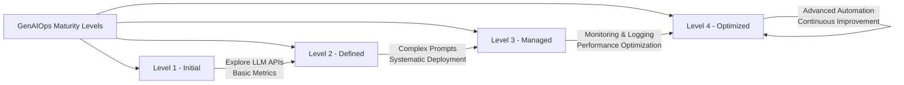

# Overview of Microsoft Azure GenAIOps Maturity Levels

Costa Rica

[brown9804](https://github.com/brown9804)

Last updated: 2025-02-19

----------

> **Generative Artificial Intelligence Operations (GenAIOps)**, also known as LLMOps, describes the operational practices and strategies for managing large language models (LLMs) in production. The maturity levels help organizations understand and improve their capabilities in managing these models.

| Maturity Level | Description | Focus |
|----------------|-------------|-------|
| **Level 1 - Initial** | Organizations are exploring LLM capabilities without structured practices. | - Familiarize with different LLM APIs - Experiment with structured prompt design - Introduce basic metrics for LLM application performance evaluation |
| **Level 2 - Defined** | Organizations have started to systematize LLM operations with structured development and experimentation. | - Develop more complex prompts - Integrate prompts into applications - Implement systematic approaches for LLM application deployment |
| **Level 3 - Managed** | Organizations have established processes for managing LLMs, including monitoring, logging, and performance optimization. | - Enhance monitoring and logging capabilities - Optimize performance - Ensure compliance with best practices |
| **Level 4 - Optimized** | Organizations have fully optimized their LLM operations, with continuous improvement and advanced automation. | - Implement advanced automation - Continuous improvement practices - Leverage cutting-edge tools and techniques for LLM management |

  <h3 style="color: #4CAF50;">Total Visitors</h3>
  

